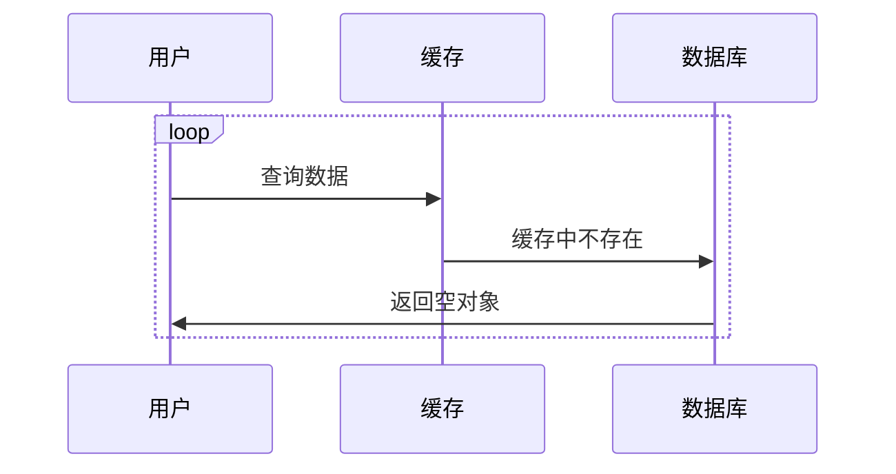
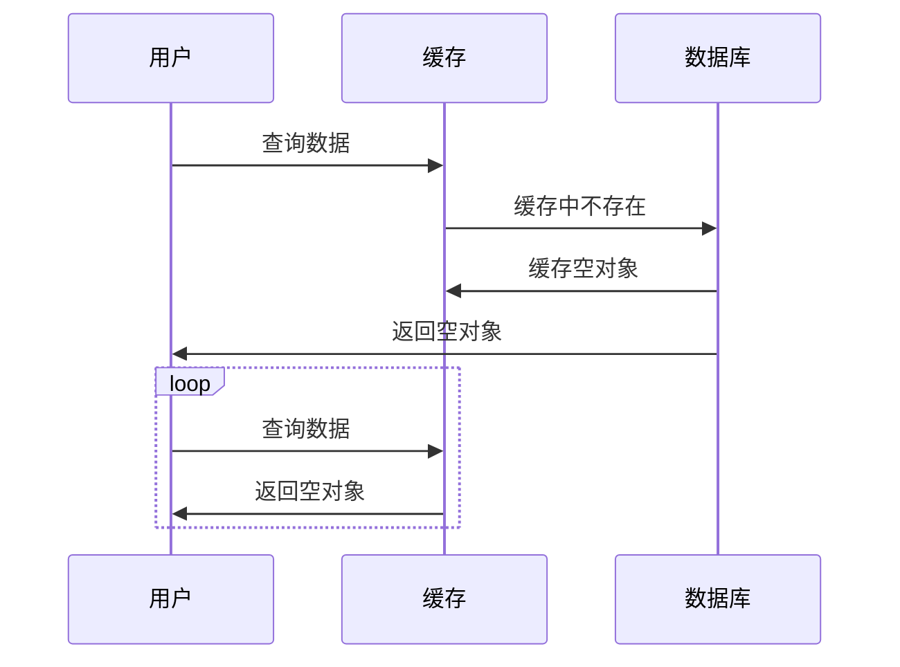
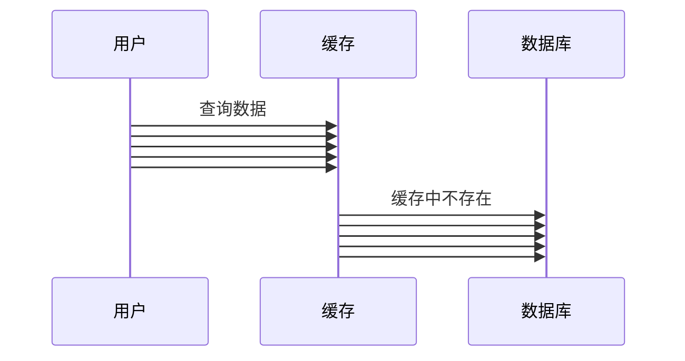
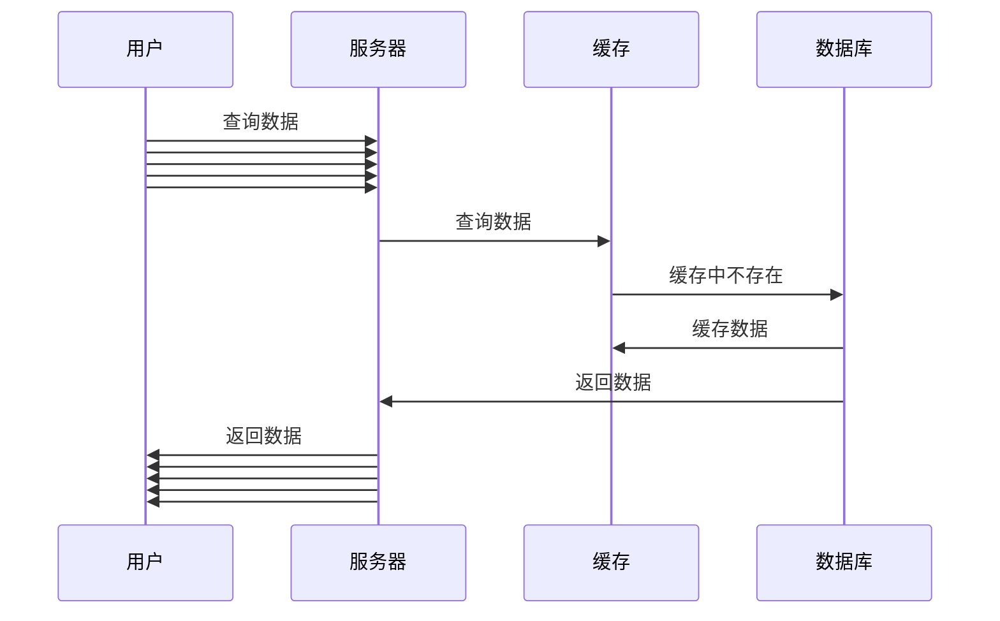
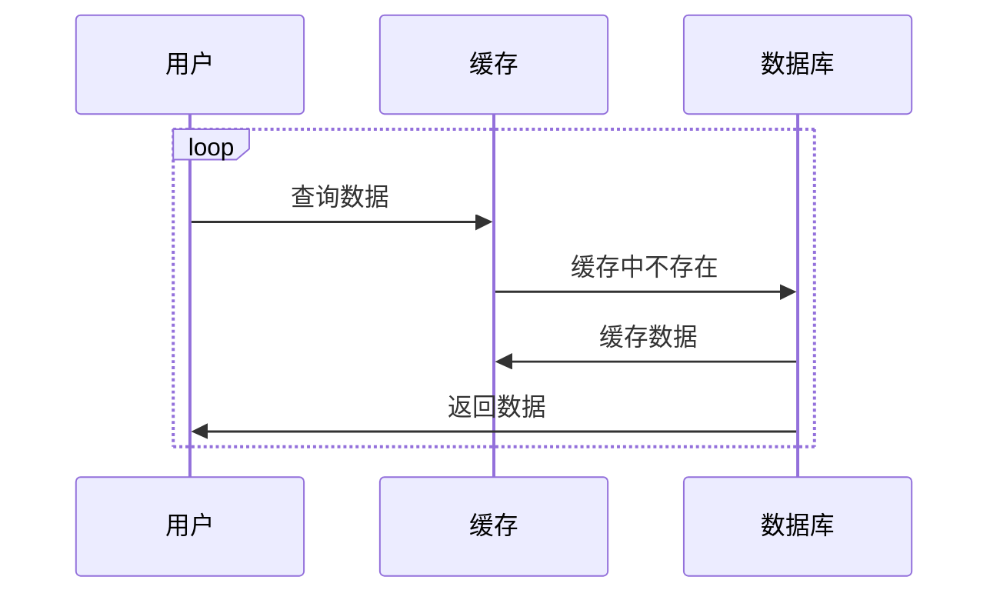
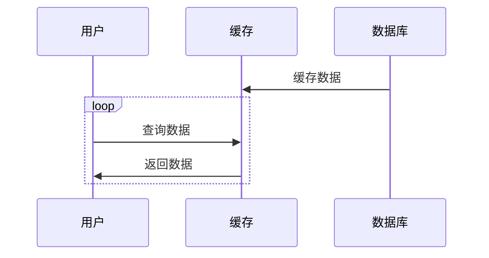

## 缓存穿透(Cache Penetration)
> 是指用户**重复**请求一个数据库和缓存中都不存在的记录，当用户在缓存中查找不到时就会读取数据库，增加数据库压力。

解决方案：
### 缓存空对象
> 当请求的数据在数据库和缓存中都不存在时，将数据库返回的空对象储存至缓存内，下次收到同样的请求就可直接从缓存获取，无需读取数据库，减少数据库压力

缺点：缓存内会储存大量空对象，占用内存浪费资源

优点：代码维护简单，可将缓存内的空对象设置较短的过期时间减少资源占用

### 布隆过滤器(Bloom Filter)
> 布隆过滤器可以迅速判断一个元素是否在一个集合中，当用户访问不存在的缓存时可以迅速返回，减少缓存和数据库的压力

布隆过滤器会将数据库中的**主键**通过**数个哈希函数**得出一个**整数索引值**，对**二进制位数组**进行**取模运算**上得到一个位置。每个哈希函数都会算得一个不同的位置，把位数组上几个位置都设置为1，代表数据库中该主键包含数据。

缺点：代码维护复杂，有可能会误判

优点：高空间效率，高查询效率
## 缓存击穿(Cache Breakdown)
> 短时间内突然有大量请求访问一个没有被缓存的数据(冷门数据或者缓存过期)，大量请求同时涌入服务器在缓存中找不到数据直接访问数据库，导致数据库压力过大甚至宕机。

解决方案：
### 合并请求
> 当短时间突然有大量请求访问同一个数据时，可以合并该请求(将除了第一个请求以外的后续请求阻塞)，等到第一个请求返回后，所有请求一起返回。

## 缓存雪崩(Cache Avalanche)
> Redis突然宕机或大部分数据同时过期时，大量请求同时涌入服务器在缓存中找不到数据直接访问数据库，导致数据库压力过大甚至宕机。

解决方案：
### 缓存预热
> 在系统上线后，预先将相关的缓存数据直接加载到缓存系统中，避免在用户访问的时候先查询数据库再缓存数据
